# Guía de estilo de la interfaz

Cómo se ve y cómo se construye la web de Skynet tras el rediseño (UI-A a UI-F, octubre de 2026) y los colores personalizables (UI-G). Su origen está en el lenguaje visual de [ADR-0001 §5.1](adr/0001-control-plane-user-interface.md) y en la maqueta [`docs/ui/maqueta.html`](ui/maqueta.html). Esta guía recoge lo que quedó implementado y las reglas para las pantallas nuevas.

| Claro | Oscuro |
| --- | --- |
| 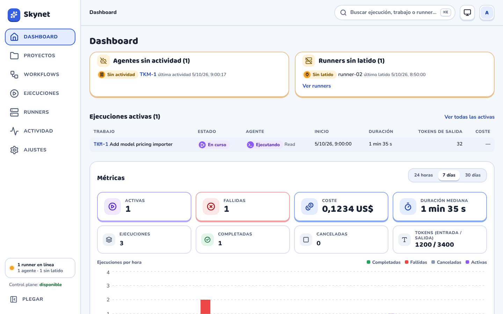 | 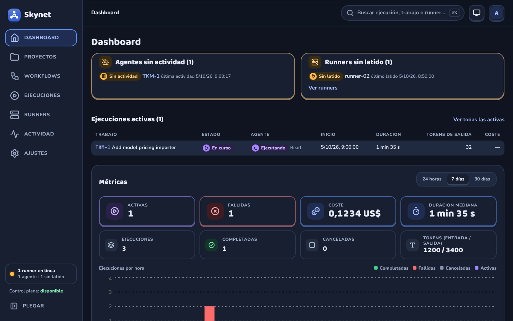 |
| 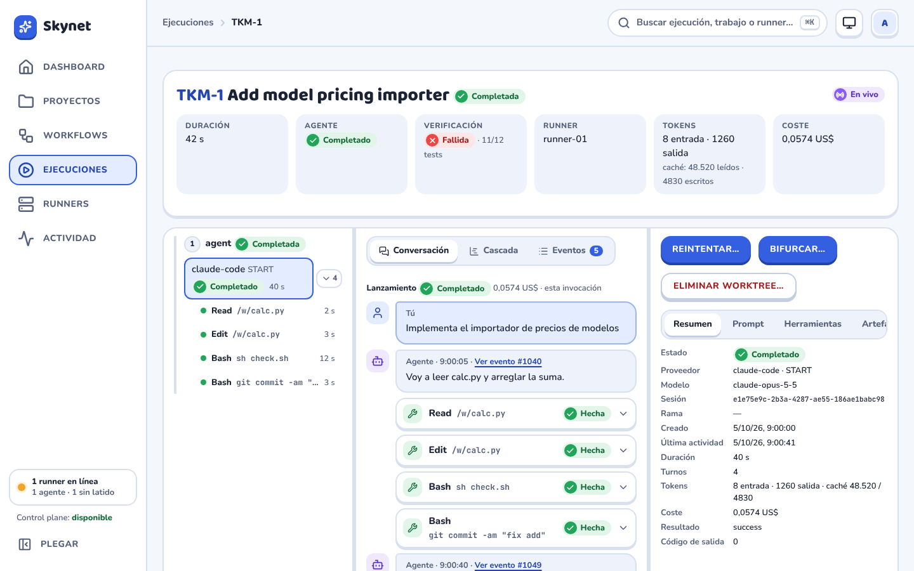 | 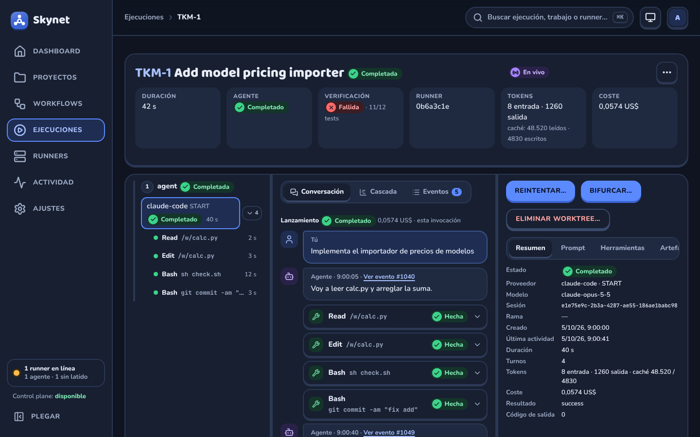 |

## 1. Principios

- **El estado manda.** Cada estado lleva color, icono y texto, nunca solo color. Lo que está vivo late (la píldora morada) y nada más se anima sin motivo.
- **Primero lo que pide atención.** El dashboard empieza por lo que falla o no responde; las listas filtran por estado; una ejecución abre en la conversación del agente que importa.
- **Todo enlazable.** Filtros, pestañas, la vista de actividad, el agente y la herramienta elegidos viven en la URL. Copiar la dirección comparte exactamente lo que se ve.
- **Formularios aparte.** Crear, configurar, lanzar y confirmar se hace en un panel lateral; la página de fondo no cambia hasta que se guarda.
- **Táctil y redondeado.** Esquinas grandes, bordes de 2 px, sombras cortas sin desenfoque y botones con volumen que se hunden al pulsarlos.

## 2. Tokens

Todos los colores, radios y profundidades son variables CSS en `web/src/index.css` (`:root`), con un bloque para el tema oscuro (`prefers-color-scheme` y `[data-theme='dark']`). Tailwind 4 los expone como utilidades (`bg-surface`, `text-muted`, `rounded-lg`…). **No se escriben colores sueltos en los componentes**: así el tema oscuro y la paleta personalizable (§9) cambian toda la web, Monaco incluido.

| Grupo | Tokens | Uso |
| --- | --- | --- |
| Superficies | `--bg`, `--surface`, `--surface-2`, `--border`, `--border-strong` | Fondo de página, tarjetas, campos y separadores |
| Texto | `--fg`, `--muted` | Texto principal y secundario (AA sobre `--surface` y `--surface-2`) |
| Acento | `--primary`, `--primary-shade`, `--primary-soft`, `--primary-ink`, `--on-primary` | Botón principal, selección, foco y enlaces |
| Estados | `--ok`, `--warn`, `--bad`, `--live`, `--idle`, cada uno con `-shade`, `-soft` e `-ink` | Píldoras, puntos del árbol, barras de la cascada y avisos |
| Botones de estado | `--ok-btn`, `--bad-btn` y sus `-shade` | Más oscuros que el estado, para que el texto blanco llegue a AA |
| Formas | `--r-sm` (12), `--r-md` (16), `--r-lg` (22) | Campos, bloques internos y tarjetas |
| Profundidad | `--lift` (4 px), `--lift-card` (3 px) | Sombra firme de botones y tarjetas |
| Movimiento | `--ease-pop`, `--animate-pop`, `--animate-pulse-ring` | Entradas con rebote y el latido de lo vivo |

Para cada estado: el color sólido (`--ok`) va en iconos y barras; `-soft` es el fondo de la píldora; `-ink` es el texto sobre ese fondo; `-shade` es la sombra o el borde.

## 3. Tipografía

- **Baloo 2** para títulos (`h1`–`h3`, `--font-display`).
- **Nunito** para el texto (`--font-sans`), con pesos 600–800: la interfaz es densa y el peso ayuda a leerla.
- **JetBrains Mono** (`--font-mono`) solo para IDs, claves, hashes, comandos, rutas y payloads.

Las tres van empaquetadas con la web (`@fontsource`), sin peticiones a terceros.

## 4. Componentes

Las piezas base están en `web/src/components/ui/`. Las de listas, en `components/list/`.

| Componente | Para qué | Notas |
| --- | --- | --- |
| `Button` | Acciones | Variantes `primary`, `secondary`, `success`, `danger`, `secondary-danger` y `link`; tamaño `sm`. Una sola acción principal por zona. |
| `Pill` / `StatusBadge` | Estados | Color, icono y texto. `StatusBadge` traduce el estado de la API con `format.ts`. |
| `TabList` / `TabPanel` | Pestañas | Patrón WAI-ARIA: flechas, Inicio y Fin. La pestaña elegida se guarda en la URL quien la usa. |
| `Sheet` | Formularios y confirmaciones | Panel lateral sobre Radix Dialog: guarda el foco, se cierra con Escape o fuera y lo devuelve al botón. En el móvil sube desde abajo. |
| `DataTable` y `ColumnsMenu` | Listas | Filas en bloques redondeados, columnas que se ocultan (se recuerdan) y estado vacío propio. |
| `EmptyState` | Listas vacías | Icono, una frase y, si se puede hacer algo, la acción («Crear el primero»). |
| `Skeleton`, `TableSkeleton`, `CardsSkeleton`, `TilesSkeleton`, `RunSkeleton`, `LinesSkeleton` | Carga | Ocupan el sitio de lo que llega con su misma forma, y lo anuncian una vez a los lectores de pantalla («Cargando las ejecuciones…»). |
| `JsonView` | Payloads | Plegable por niveles, cadenas largas recortadas y «Copiar JSON». |
| `CodeView` | Diff, logs y código | Monaco diferido con el tema de la web; mientras llega, el mismo texto en un bloque normal. |
| `ArchiveMenu`, `ArchivedBanner`, `ArchivedToggle`, `BulkRunActions` | Archivar y eliminar | En `components/archive/`. Menú «⋯» con Archivar, o Restaurar y «Eliminar…» sobre lo archivado; aviso de solo lectura con «Restaurar»; chip «Archivados» de las listas; barra de las ejecuciones seleccionadas. |

### Patrones

- **Página.** `h1` con el nombre y, a la derecha, sus acciones (`.page-head`, `.page-actions`). Debajo, pestañas si hay varias secciones.
- **Lista.** Barra de herramientas (búsqueda, filtros como *chips* y columnas), tabla, paginador. Mientras carga, `TableSkeleton`; vacía, `EmptyState` (con «Quitar los filtros» si hay filtros).
- **Tarjeta de recurso.** Icono teñido, nombre, ruta en mono y una etiqueta (`.tag`); debajo, secciones separadas por una línea con su botón de configurar (repositorios, workflows).
- **Formulario.** En un `Sheet`, etiquetas en negrita encima del campo, ayudas en `.hint`, grupos en `fieldset.limits` y acciones en `.form-actions`. Tras guardar, «Guardado.» en verde (`role="status"`); tras crear, el panel se cierra.
- **Confirmación con coste.** Reintentar, bifurcar o eliminar explican qué harán en un aviso amarillo antes del botón, y el botón dice la acción («Eliminar», no «Aceptar»).
- **Archivado.** Proyectos, repositorios, trabajos, ejecuciones y runners llevan un menú «⋯» (en la página y en cada fila). Archivar y restaurar se hacen al momento; los runners se «olvidan». Lo archivado sale de las listas salvo con el chip «Archivados» (en runners, «Olvidados»), y su página lleva un aviso de solo lectura con «Restaurar» y esconde lo que crea o lanza. Si lo archivado es el padre, el aviso lo dice y no hay botón.
- **Eliminar.** Solo sobre lo archivado, desde «Eliminar…», que abre un `Sheet` con lo que se borraría (`deletion-preview`), los avisos y lo que lo impide. Si lo impiden worktrees vivos, el panel ofrece eliminarlos y vuelve a mirar cada 3 s hasta poder seguir. «Eliminar definitivamente» queda desactivado hasta entonces. En la lista de ejecuciones se pueden marcar varias para archivarlas, restaurarlas o eliminarlas de una vez; las que fallan se listan con su motivo.
- **Ejecución.** Tres paneles redimensionables (pasos, actividad e inspector) que en el móvil pasan a pestañas. La actividad tiene conversación, cascada y eventos.

## 5. Movimiento

- Cada página entra con un fundido de 220 ms; las pestañas y los estados vacíos, con uno de 180 ms.
- Los botones se hunden al pulsarlos; los iconos de estado nuevos aparecen con un «pop».
- Lo que sigue en curso late (píldoras moradas) o se raya (barras de la cascada).
- Con `prefers-reduced-motion: reduce` no hay entradas, rebotes ni brillos: todo aparece en su sitio.

## 6. Accesibilidad

- Contraste AA en los dos temas: la E2E pasa axe en todas las páginas, las pestañas de la ejecución y los paneles laterales, en claro y en oscuro (`web/e2e/review.e2e.ts`).
- Todo se usa con teclado: enlace para saltar al contenido, foco visible (anillo de `--primary`), flechas en pestañas y en el árbol, y los separadores de paneles se mueven con las flechas.
- Los botones que solo tienen icono llevan `aria-label`; las regiones con scroll propio son enfocables.
- Las regiones que cambian solas (estado del stream, «Guardado.», cargas) usan `role="status"`.

## 7. Responsive

- Hasta 900 px, la ejecución pasa a pestañas (Pasos, Actividad, Detalle).
- Hasta 720 px, la barra lateral pasa a una barra inferior con las cuatro secciones principales y un cajón «Más».
- Hasta 640 px, el panel lateral sube desde abajo y las acciones de la cabecera ocupan el ancho.
- Hasta 520 px, las cifras del dashboard y de la ejecución van de dos en dos.
- En pantallas grandes, el contenido ocupa todo el ancho del navegador, sin máximo.
- Ninguna página se desplaza en horizontal: las tablas anchas se desplazan dentro de su bloque.

| Dashboard | Ejecución |
| --- | --- |
| 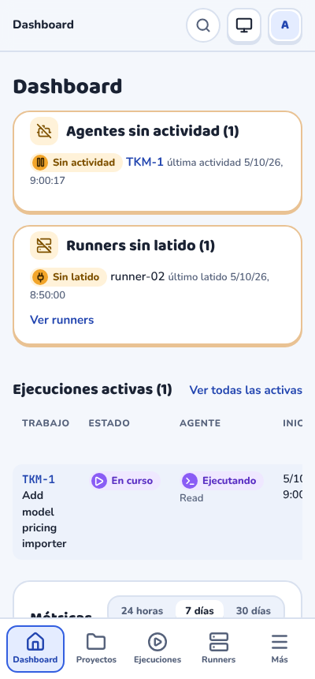 | 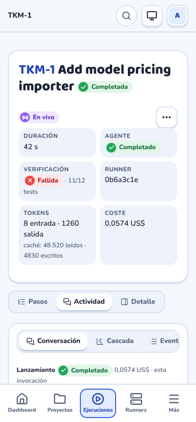 |

## 8. Capturas

Las capturas de `docs/ui/capturas/` salen de la web compilada contra una API simulada con los datos de `fixtures/contracts`:

```bash
cd web
npm run build && npx vite preview --port 4174 &
node scripts/capturas.mjs http://localhost:4174
```

Al cambiar una pantalla, vuelve a generarlas en la misma PR.

| Pantalla | Claro | Oscuro |
| --- | --- | --- |
| Ejecuciones | 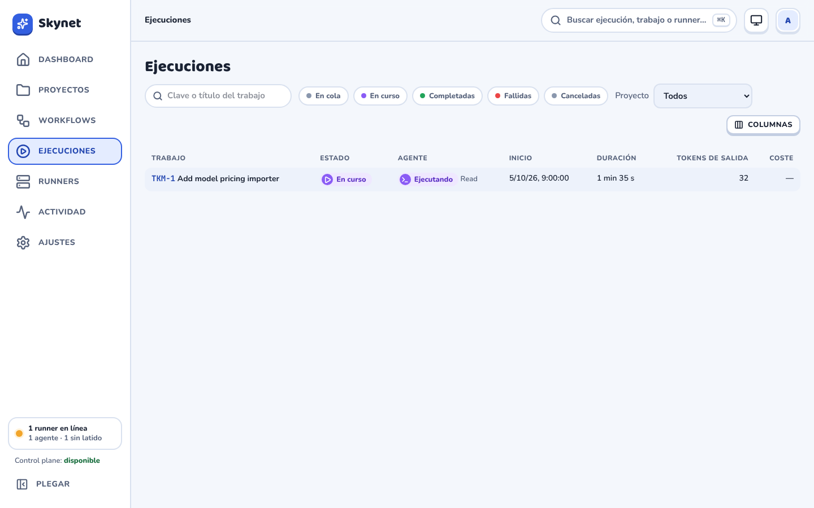 | 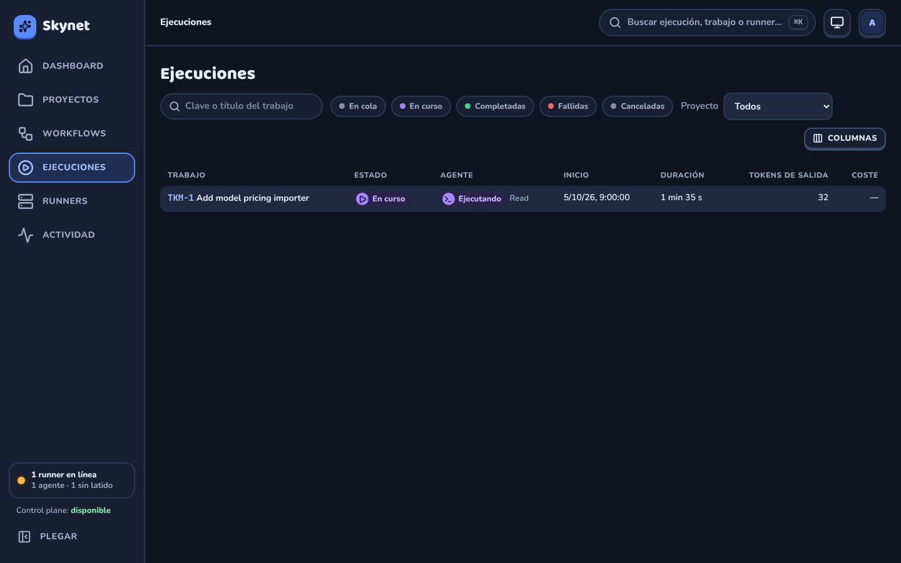 |
| Cascada y diff | 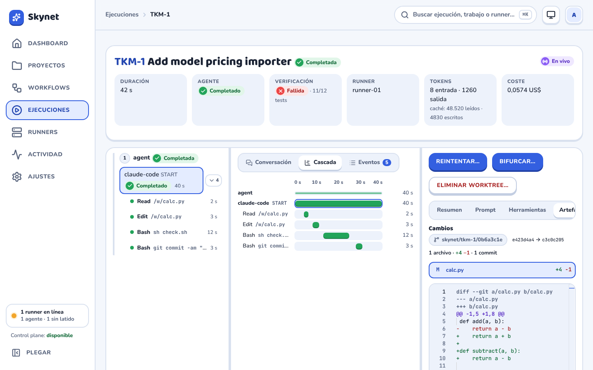 | 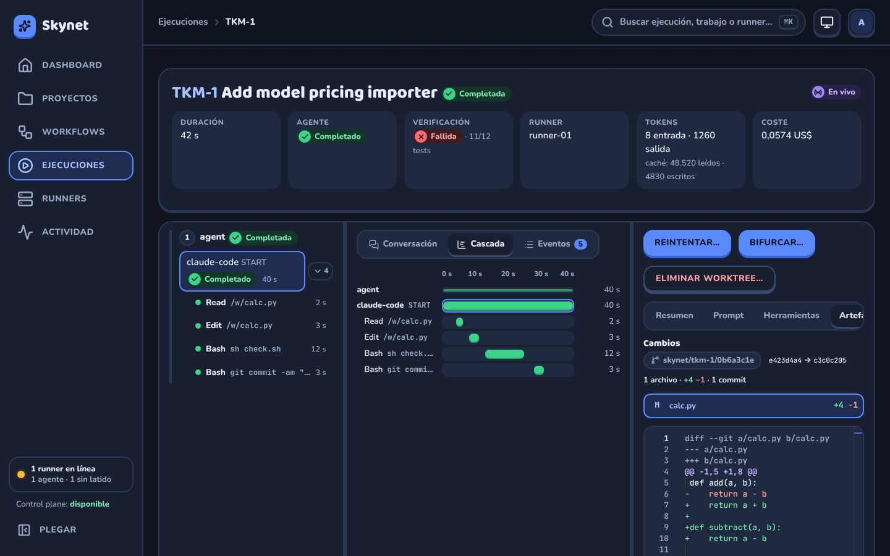 |
| Proyecto | 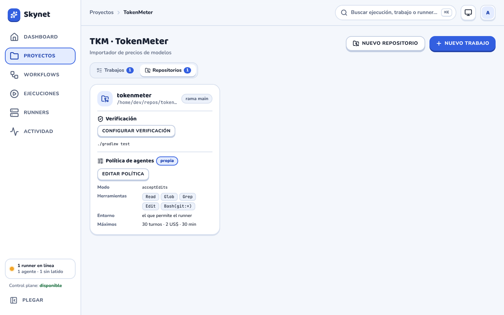 | 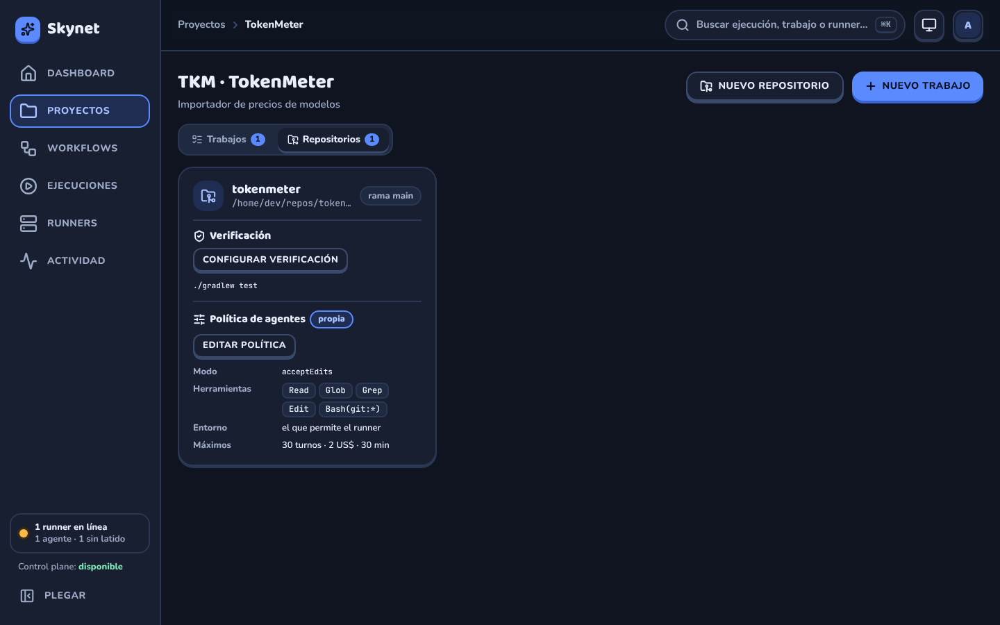 |
| Lanzar agente | 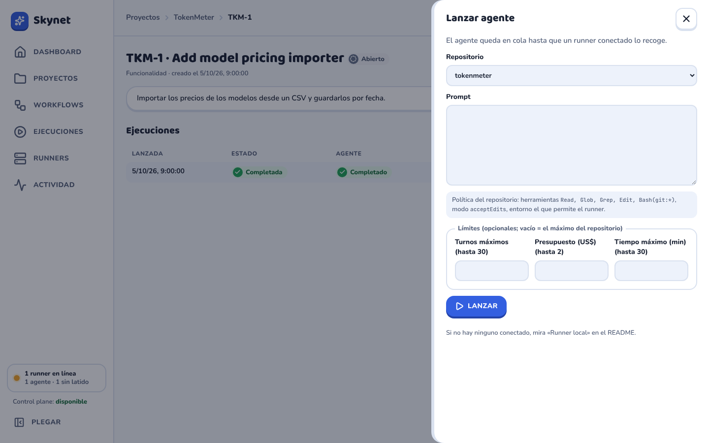 | 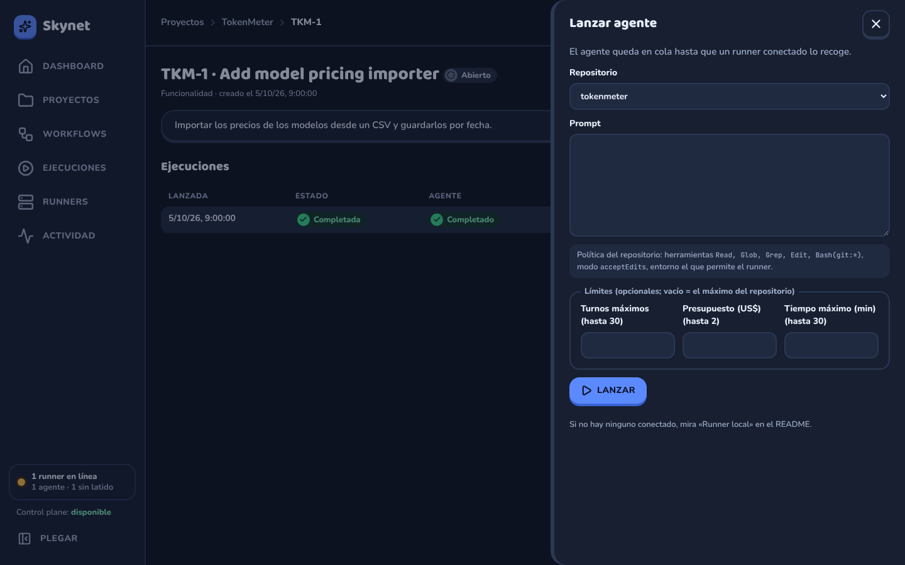 |
| Ajustes | 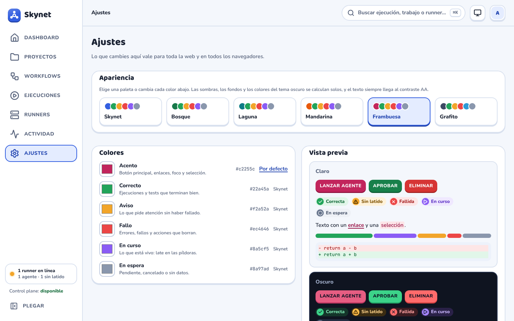 | 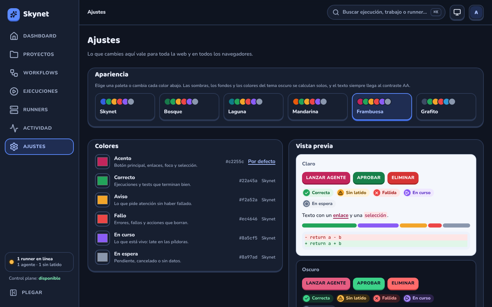 |

## 9. Colores personalizables

En **Ajustes** (`/settings`) se elige una paleta predefinida o un color base para el acento y cada estado. Lo guardado vale para toda la web y para todos los navegadores (UI-G).

| Claro | Oscuro |
| --- | --- |
|  |  |

- **Solo se guarda el color base** de cada pieza en el tema claro: `primary`, `ok`, `warn`, `bad`, `live` e `idle`. La guarda `PUT /api/settings/appearance`, en la tabla `app_setting`. Un color vacío es el de Skynet.
- **El resto se deriva** en `web/src/lib/palette.ts`. Cada token (`-shade`, `-soft`, `-ink`, `-btn`, y todos los del tema oscuro) guarda con su base la misma relación en OKLCH que en la paleta de Skynet, así que con los colores por defecto sale exactamente `index.css`; un test lo comprueba. Los fondos suaves y la tinta conservan su luminosidad, porque son fondo y texto del tema.
- **Contraste.** La tinta se oscurece (o se aclara en oscuro) hasta llegar a AA sobre su fondo suave y sobre las superficies, y los botones de estado hasta llegar a AA con su texto. El texto del botón principal pasa de blanco a oscuro si hace falta. Si ninguno de los dos llega, la página lo explica y no deja guardar.
- **Aplicación.** `appearance.ts` escribe los tokens en una hoja `<style id="skynet-palette">` con `:root:root`, que gana a `index.css` en los dos temas, y marca `data-palette` en `<html>` para que Monaco relea los colores. La paleta se lee sin sesión, así que el login también sale con ella. La última que se vio se guarda en este navegador para pintar la carga siguiente sin esperar al servidor.
- **Si cambias un token en `index.css`,** cámbialo también en `DEFAULTS` de `palette.ts`; el test lo avisa.
